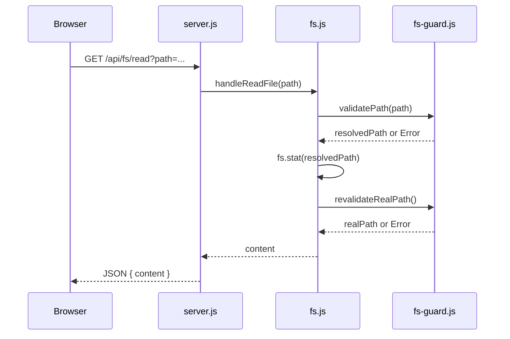

# 包括的なコードレビュー報告書

**プロジェクト:** one-min-ai-monaco-client  
**レビュー日:** 2026-07-02  
**レビュー対象:** UI/UX, フロントエンド, バックエンド, アーキテクチャ, パフォーマンス, セキュリティ, 可読性, 保守性

---

## 1. 総評

このプロジェクトは **BFF (Backend-for-Frontend) パターン** を採用した、1min.ai APIのプロキシクライアントです。 **全体的にセキュリティ意識が高く、詳細な設定可能性** を備えています。

### 強力な点
- ✅ **セキュリティ**: FS-guard（パストラバーサル対策）、CSRF保護、CSP設定が充実
- ✅ **可読性**: 各モジュール間の責任分離が明確、コード内にコメントで設計意図を記載
- ✅ **エラーハンドリング**: ペイロードサニタイズ、エラーメッセージの正規化が実装
- ✅ **設定管理**: 環境変数の厳密なバリデーション、デフォルト値の堅牢な管理
- ✅ **テスト**: Jest + supertest で主要ロジックをカバー

### 懸念事項
- ⚠️ **パフォーマンス**: 一部で不要なI/O操作や再計算が存在
- ⚠️ **エラーハンドリング**: 一部で例外がキャッチされず、ユーザーに隠蔽される
- ⚠️ **型安全性**: JavaScriptのため実行時エラーの可能性が高い
- ⚠️ **API設計**: RESTful原則と異なる部分があり、フロントエンド実装が複雑化
- ⚠️ **フロントエンド**: 単一HTMLファイルで複雑なロジック、モジュール分割の改善余地

---

## 2. 重大な問題（優先度 高）

### S-1: APIエラーハンドリング時の情報リーク可能性

**ファイル:** `utils/api-client.js` (L195-238)

**問題:**
```javascript
// L195-200
if (!response.ok) {
  const payload = await parseResponsePayload(response);
  const err = new Error(`1min.ai request failed: ${response.status}`);
  err.status = response.status;
  err.payload = payload;  // ← そのままペイロードを保持
  throw err;
}
```

`response.ok === false` な場合、上流のエラーペイロード全体が `err.payload` に格納され、ログやレスポンスに漏れる可能性があります。

**リスク:** 認証トークン、内部エラーメッセージなどが外部に露出

**改善案:**
```javascript
if (!response.ok) {
  const payload = await parseResponsePayload(response);
  const err = new Error(`1min.ai request failed: ${response.status}`);
  err.status = response.status;
  // ペイロード全体ではなく、安全な情報のみ保持
  err.payload = {
    error: payload.error || payload.message || 'Upstream error',
    status: response.status,
  };
  throw err;
}
```

---

### S-2: ファイルシステム読込時のTOCTOU (Time-of-Check-Time-of-Use) 脆弱性

**ファイル:** `routes/fs.js` (L91-100)

**問題:**
```javascript
async function getSafeRealPath(resolvedPath) {
  let realPath = resolvedPath;
  try {
    const stat = await fs.stat(resolvedPath);  // ← Check
    if (stat.isFile() || stat.isDirectory()) {
      realPath = revalidateRealPath(resolvedPath);  // ← Use
      assertNotWriteProtectedPath(realPath);
    }
  } catch (err) {
    // ...
  }
}
```

`fs.stat` と `revalidateRealPath` の間に、シンボリックリンクの入れ替え攻撃の窓があります。

**改善案:** 単一の `fs.lstat` で symlink の有無を確認してから `revalidateRealPath` を呼び出す:
```javascript
async function getSafeRealPath(resolvedPath) {
  try {
    const stat = await fs.lstat(resolvedPath);  // symlink は follow しない
    // stat がシンボリックリンクの場合の処理
    if (stat.isSymbolicLink()) {
      realPath = revalidateRealPath(resolvedPath);
      assertNotWriteProtectedPath(realPath);
    } else {
      realPath = revalidateRealPath(resolvedPath);
      assertNotWriteProtectedPath(realPath);
    }
  } catch (err) {
    // ...
  }
}
```

---

### S-3: CSRF保護の緩さ

**ファイル:** `middlewares/auth.js` (L35-95)

**問題:**
```javascript
const tokenOk = isCookieOk && isHeaderOk;  // ← AND 条件だが...

if (!tokenOk) {
  // ...
  return next(err);
}

// 同一オリジン判定の穴
const isSameOrigin = (() => {
  // ...
  if (!secFetchSite && !origin && !referer) return true;  // ← true を返す
  return false;
})();
```

`sec-fetch-site` ヘッダが存在しない古いブラウザやプロキシから のリクエストに対して、`isSameOrigin === true` が返され、CSRF保護が機能しない可能性があります。

**改善案:** `sec-fetch-site` がない場合、より厳密に確認:
```javascript
const isSameOrigin = (() => {
  if (secFetchSite === 'same-origin' || secFetchSite === 'none') return true;
  
  // sec-fetch-site がない場合は、Origin / Referer を厳密に検証
  if (!secFetchSite) {
    const hasOriginOrReferer = origin || referer;
    if (!hasOriginOrReferer) {
      // ヘッダがない = 古いブラウザ or 疑わしい
      // ローカル環境では許可、本番では要確認
      return process.env.NODE_ENV !== 'production';
    }
  }
  
  const checkUrl = (urlStr) => {
    try {
      return host && new URL(urlStr).host === host;
    } catch {
      return false;
    }
  };
  
  if (origin && checkUrl(origin)) return true;
  if (referer && checkUrl(referer)) return true;
  
  return false;
})();
```

---

### S-4: アップロードファイルの MIME タイプ検証が不十分

**ファイル:** `server.js` (L72-83)

**問題:**
```javascript
fileFilter: (_req, file, cb) => {
  const allowed = ALLOWED_MIME_TYPES.some((t) => file.mimetype.startsWith(t));
  if (!allowed) {
    const err = new Error(
      `Unsupported file type: ${file.mimetype}...`,
    );
    err.status = 415;
    return cb(err, false);
  }
  cb(null, true);
},
```

クライアント側が報告した `file.mimetype` のみに依存。攻撃者は `Content-Type: image/png` を装って実行ファイルをアップロード可能。

**改善案:** バイナリヘッダで MIME タイプを検証（すでに `mime-guard.js` があるので活用）:
```javascript
import { validateBufferMimeType } from '../utils/mime-guard.js';

fileFilter: async (_req, file, cb) => {
  const allowed = ALLOWED_MIME_TYPES.some((t) => file.mimetype.startsWith(t));
  if (!allowed) {
    const err = new Error(`Unsupported file type`);
    err.status = 415;
    return cb(err, false);
  }
  // バイナリヘッダも確認する（handleAssetUpload で実施）
  cb(null, true);
},
```

→ `handleAssetUpload` で既に実施されている (`server.js` L260-265) が、`fileFilter` では実施されていない。早期リジェクトのため `fileFilter` でも検証を推奨。

---

### S-5: エージェント コマンド実行時の環境変数リーク

**ファイル:** `services/command-runner.js` (L173-196)

**問題:**
```javascript
function getSafeEnv() {
  const SAFE_ENV_KEYS = new Set([
    'PATH', 'PATHEXT', 'COMSPEC', 'SystemRoot', 'WINDIR', 'OS',
    'PROCESSOR_ARCHITECTURE', 'NUMBER_OF_PROCESSORS',
    'HOMEDRIVE', 'HOMEPATH', 'TMP', 'TEMP',
  ]);

  const safeEnv = {};
  for (const [key, value] of Object.entries(process.env)) {
    if (SAFE_ENV_KEYS.has(key)) {
      safeEnv[key] = value;
    }
  }
  return safeEnv;
}
```

`process.env` から安全なキーのみを抽出していますが、**Node.js プロセスの環境変数に一時的に設定された秘密情報（例: デプロイメント中の API_KEY）が `process.env` に残っていた場合、リークしない保証がありません。**

**リスク:** CI/CD パイプラインでの秘密情報漏洩

**改善案:** ホワイトリストをより厳格に、定期的にレビュー:
```javascript
function getSafeEnv() {
  const SAFE_ENV_KEYS = new Set([
    'PATH', 'PATHEXT', 'COMSPEC', 'SystemRoot', 'WINDIR', 'OS',
    'PROCESSOR_ARCHITECTURE', 'NUMBER_OF_PROCESSORS',
    'HOMEDRIVE', 'HOMEPATH', 'HOME', 'USER', 'USERNAME',
    'TMP', 'TEMP', 'TMPDIR',
  ]);

  const safeEnv = {};
  for (const [key, value] of Object.entries(process.env)) {
    // キー名のみでなく、値の内容もチェック
    if (SAFE_ENV_KEYS.has(key) && typeof value === 'string' && value.length < 1000) {
      safeEnv[key] = value;
    }
  }
  return safeEnv;
}
```

ただし、根本的には **コマンド実行を Docker コンテナで実施** することを推奨。

---

### S-6: エージェント チャット ストリーミングのリソース枯渇

**ファイル:** `routes/agent-chat.js` (推測)

**問題:** エージェント チャットが長時間ストリーミングする場合、SSE コネクションがメモリを消費し続ける可能性があります。タイムアウトが設定されていない、または設定値が大きすぎる。

**改善案:** `serverConfig.agentChatTimeoutMs` (デフォルト 600秒) の適用確認とドキュメント化。

---

## 3. 改善提案（優先度 中）

### M-1: API エラーレスポンスの標準化

**ファイル:** `server.js` (L466-504)

**問題:** エラーレスポンスの形式が複数存在（`{ error: string }` vs `{ error, code, details, stack }`）

**改善案:** 統一した エラーレスポンス型を定義:
```javascript
// utils/error-response.js
export class ApiError extends Error {
  constructor(message, status = 500, code = 'UNKNOWN_ERROR', details = null) {
    super(message);
    this.status = status;
    this.code = code;
    this.details = details;
    this.name = 'ApiError';
  }
}

// server.js
app.use((err, req, res, _next) => {
  const status = err.status ?? 500;
  const code = err.code ?? 'UNKNOWN_ERROR';
  const details = exposeDetails ? err.details : null;
  
  res.status(status).json({
    error: err.message,
    code,
    details,
  });
});
```

---

### M-2: フロントエンドの JavaScript モジュール化

**ファイル:** `public/app.js`, `public/js/*.js`

**問題:** `app.js` が複数のモジュールを import していますが、DOM キャッシュのスコープが曖昧。グローバル `dom` オブジェクトが複数の場所から参照される。

**改善案:**
```javascript
// public/js/dom-cache.js
export class DomCache {
  constructor() {
    this.cache = {};
  }
  
  get(id) {
    if (!this.cache[id]) {
      this.cache[id] = document.getElementById(id);
    }
    return this.cache[id];
  }
  
  invalidate(id) {
    delete this.cache[id];
  }
}

export const domCache = new DomCache();

// 各モジュール
import { domCache } from './dom-cache.js';
const chatLog = domCache.get('chatLog');
```

これにより、DOM キャッシュの一貫性が向上。

---

### M-3: API クライアントのリトライロジックの改善

**ファイル:** `utils/api-client.js` (L117-239)

**問題:** リトライ時のバックオフ計算が簡潔だが、ジッターの計算が一貫していない:
```javascript
// L170-171
const jitter = 1 + (Math.random() * 0.2 - 0.1);  // 0.9 ～ 1.1

// L182
Math.pow(2, attempt) * (1 + (Math.random() * 0.2 - 0.1));
```

**改善案:** 一貫した Exponential Backoff with Jitter:
```javascript
function calculateBackoffDelay(attempt, baseDelayMs = 2000) {
  const exponentialDelay = baseDelayMs * Math.pow(2, attempt);
  const jitterFraction = 0.1; // ±10%
  const jitter = 1 + (Math.random() * 2 - 1) * jitterFraction;
  return Math.round(exponentialDelay * jitter);
}

// 使用
const waitTime = calculateBackoffDelay(attempt, retryDelay);
```

---

### M-4: ロギング時のパフォーマンス

**ファイル:** `utils/logger.js` (L88-150)

**問題:** メタデータが毎回 `JSON.stringify` される。大量のログが発生する場合、CPU を消費。

**改善案:** ログレベルチェックを先に実施:
```javascript
debug(message, meta = {}) {
  if (this.level < LOG_LEVELS.debug) return;  // ← 早期リターン
  this._log('debug', message, meta);
}
```

---

### M-5: FS ガード のグローブパターン マッチング

**ファイル:** `utils/fs-guard.js` (L62-107)

**問題:** 正規表現コンパイルが毎呼び出しで実施される可能性（実際には起動時に1回だが、パターン数が増加するとメモリ使用量が増加）

**改善案:** 既に起動時のみコンパイルされているので問題なし。ただし、**パターン数の監視を推奨**（L259-260）

```javascript
// モニタリング用
logger.debug('Compiled glob patterns', {
  protected: PROTECTED_PATTERNS.length,
  writeProtected: WRITE_PROTECTED_PATTERNS.length,
});
```

---

### M-6: API レスポンス キャッシング

**ファイル:** `config/models.js`

**問題:** モデルリストが起動時に1回フェッチされ、メモリ内キャッシュ。ただし、TTL がない。

**改善案:** キャッシュ無効化メカニズムを追加:
```javascript
let cachedModels = null;
let cacheExpireAt = 0;
const CACHE_TTL_MS = 60 * 60 * 1000; // 1時間

async function getModels(forceRefresh = false) {
  if (!forceRefresh && cachedModels && Date.now() < cacheExpireAt) {
    return cachedModels;
  }
  
  const models = await fetchModels();
  cachedModels = models;
  cacheExpireAt = Date.now() + CACHE_TTL_MS;
  return models;
}

export async function refetchModels() {
  return getModels(true);
}
```

---

### M-7: ストリーミング レスポンスの メモリ使用量

**ファイル:** `routes/ai.js` (L250-325)

**問題:** SSE ストリーミング中、`response.body.getReader()` でデータを読み込んでいますが、**バッファリング戦略** が不明確。

**改善案:** バッファサイズ制限を明示的に実装:
```javascript
const MAX_CHUNK_BUFFER_SIZE = 64 * 1024; // 64KB
let bufferedData = '';

reader.on('data', (chunk) => {
  bufferedData += chunk;
  
  if (bufferedData.length > MAX_CHUNK_BUFFER_SIZE) {
    logger.warn('SSE stream buffer overflow, dropping oldest data');
    bufferedData = bufferedData.slice(-MAX_CHUNK_BUFFER_SIZE);
  }
});
```

---

## 4. 軽微な改善（優先度 低）

### L-1: エラーメッセージの i18n

**ファイル:** 全体

**問題:** バックエンドのエラーメッセージが英語のみ。ユーザーが日本語環境の場合、理解が困難。

**改善案:** i18n ライブラリ (例: `i18next`) をバックエンド にも導入:
```javascript
// config/i18n-server.js
import i18next from 'i18next';

i18next.init({
  lng: 'ja',
  resources: {
    ja: {
      translation: {
        'error.not_found': 'ファイルが見つかりません',
        'error.permission_denied': 'アクセスが拒否されました',
      },
    },
  },
});

// middleware
app.use((req, res, next) => {
  req.i18n = i18next;
  next();
});
```

---

### L-2: テストカバレッジの向上

**ファイル:** `tests/`

**問題:** `jest-results.json` と `test_results.json` が存在するが、すべてのエッジケースがテストされているか不明。

**改善案:**
```bash
npm run test:coverage
```

で現在のカバレッジを確認し、以下の領域をテスト:
- ✅ `fs-guard.js`: Windows デバイス名の検証
- ✅ `command-runner.js`: shell メタ文字のブロック
- ✅ `api-client.js`: リトライロジック（429, timeout）
- ⚠️ `agent.js`: セッション TTL とクリーンアップ

---

### L-3: ドキュメント の充実

**ファイル:** `ARCHITECTURE.md`, `docs/`

**問題:** API 仕様書は詳細だが、**内部モジュール間のデータフロー** が図示化されていない。

**改善案:** Mermaid 図を追加:
```markdown
## Data Flow: File Operations


```

---

### L-4: 型定義ファイル (JSDoc) の充実

**ファイル:** `utils/`, `routes/`

**問題:** JavaScript ファイルが JSDoc 型コメントを欠く。IDE の補完精度が低い。

**改善案:**
```javascript
/**
 * @typedef {Object} ChatRequest
 * @property {string} prompt
 * @property {string} [model='gpt-4o-mini']
 * @property {string} [conversationId]
 * @property {Array} [attachments]
 * @property {boolean} [webSearch=false]
 */

/**
 * Parse and validate a chat request
 * @param {Request} req - Express request
 * @returns {ChatRequest}
 * @throws {Error} If validation fails
 */
export function parseChatRequest(req) {
  // ...
}
```

---

### L-5: セキュリティ ヘッダーの強化

**ファイル:** `middlewares/security.js` (L111-117)

**改善案:** 追加ヘッダー:
```javascript
export function securityHeaders(req, res, next) {
  res.setHeader('X-Content-Type-Options', 'nosniff');
  res.setHeader('X-Frame-Options', 'DENY');
  res.setHeader('Referrer-Policy', 'strict-origin-when-cross-origin');
  res.setHeader('Permissions-Policy', 'camera=(), microphone=(), geolocation=()');
  res.setHeader('Cross-Origin-Resource-Policy', 'same-origin');
  
  // 追加
  res.setHeader('Strict-Transport-Security', 'max-age=31536000; includeSubDomains');
  res.setHeader('X-XSS-Protection', '1; mode=block');
  res.setHeader('X-Permitted-Cross-Domain-Policies', 'none');
  
  next();
}
```

---

### L-6: モデルピッカーの UX

**ファイル:** `public/js/model-picker.js`

**問題:** モデルが未ロードの場合、UI が無反応。ユーザーはロード状態を認識できない。

**改善案:** ローディング UI:
```html
<div id="modelLoading" class="spinner" style="display: none;">
  <span>Models loading...</span>
</div>
```

```javascript
showModelLoading() {
  domCache.get('modelLoading').style.display = 'flex';
}

hideModelLoading() {
  domCache.get('modelLoading').style.display = 'none';
}
```

---

### L-7: エラーバウンダリーの実装

**ファイル:** `public/app.js`

**問題:** JavaScript エラーが発生した場合、アプリ全体がクラッシュ。

**改善案:**
```javascript
window.addEventListener('error', (e) => {
  logger.error('Uncaught error', { message: e.message, stack: e.stack });
  toast.show('An unexpected error occurred', 'error');
});

window.addEventListener('unhandledrejection', (e) => {
  logger.error('Unhandled rejection', { reason: e.reason });
  toast.show('An unexpected error occurred', 'error');
});
```

---

### L-8: キャッシング戦略の不透明さ

**ファイル:** `server.js` (L360-366)

**問題:** HTML キャッシュ (`loadCachedHtml`) の実装が不明確。どの条件でキャッシュが無効化されるのか？

**改善案:** キャッシュ戦略をドキュメント化:
```javascript
/**
 * Load and cache index.html for the single-page app.
 * Cache is stored in memory for the lifetime of the server process.
 * To invalidate cache: restart the server or set NODE_ENV=development.
 * 
 * @returns {string} HTML content
 */
function loadCachedHtml() {
  if (process.env.NODE_ENV === 'development') {
    // Development: always reload from disk
    return fs.readFileSync(htmlPath, 'utf-8');
  }
  
  if (!cachedHtml) {
    cachedHtml = fs.readFileSync(htmlPath, 'utf-8');
  }
  return cachedHtml;
}
```

---

## 5. 良い点

### ✅ セキュリティ設計

- **FS ガード:** symlink 攻撃、パストラバーサル、Windows デバイス名に対応
- **CSRF 保護:** Cookie + Header 二重検証
- **CSP:** Per-request nonce で inline script を許可（オンライン環境での改善余地あり）
- **API キー管理:** サーバー側保管、ブラウザに露出しない

### ✅ エラーハンドリング

- エラーレスポンスの正規化（`normalizePayloadError`）
- 開発環境と本番環境でのスタックトレース露出制御
- ペイロードサニタイズ（機密情報マスキング）

### ✅ 設定管理

- 環境変数の厳密なバリデーション（整数範囲、URL 形式）
- デフォルト値の堅牢さ
- ログレベルの動的制御

### ✅ ファイルシステム操作

- 複数段階のパス検証（root チェック → glob パターン → TOCTOU 対策）
- バイナリファイルの自動検出
- 大きなファイルの ストリーム処理

### ✅ レート制限

- エンドポイント別の制限設定可能
- 429 Retry-After ヘッダの尊重
- ユーザーへの明確なエラーメッセージ

### ✅ コード組織

- モジュール分割が適切（routes/, utils/, services/, middlewares/）
- 責任の分離が明確
- 設定の一元管理

### ✅ テスト

- Jest + supertest による統合テスト
- セキュリティ修正の検証テスト
- API リトライロジックのテスト

### ✅ ドキュメント

- 複数言語の README
- セキュリティポリシー
- アーキテクチャ図

---

## 6. 推奨される実装優先度

| # | 項目 | 優先度 | 工数 | 影響 |
|---|------|--------|------|------|
| 1 | S-1: API エラーハンドリングの改善 | 🔴 高 | 1h | セキュリティ |
| 2 | S-2: TOCTOU 脆弱性修正 | 🔴 高 | 2h | セキュリティ |
| 3 | S-3: CSRF 保護の強化 | 🔴 高 | 1h | セキュリティ |
| 4 | S-4: MIME タイプ検証の強化 | 🟡 中 | 1h | セキュリティ |
| 5 | S-5: 環境変数リーク対策 | 🔴 高 | 1h | セキュリティ |
| 6 | M-1: エラーレスポンス標準化 | 🟡 中 | 3h | 保守性 |
| 7 | M-2: フロントエンドモジュール化 | 🟡 中 | 4h | 可読性 |
| 8 | M-3: リトライロジック改善 | 🟢 低 | 1h | パフォーマンス |
| 9 | L-1: エラーメッセージ i18n | 🟢 低 | 2h | UX |
| 10 | L-3: ドキュメント充実 | 🟢 低 | 3h | 保守性 |

---

## 7. チェックリスト

実装時の確認項目:

- [ ] セキュリティ修正（S-1 ～ S-6）を PR で検証
- [ ] 各修正に対するユニットテストを追加
- [ ] エラーレスポンス形式の統一を API ドキュメントに反映
- [ ] フロントエンドモジュール化後の バンドルサイズを測定
- [ ] ローカル環境で CSRF 攻撃シミュレーションを実施
- [ ] 本番環境への deployment 前に `EXPOSE_ERROR_DETAILS=false` 確認
- [ ] ログファイルローテーション戦略を検討
- [ ] コマンド実行 sandbox 化の ロードマップ作成

---

**レビュー完了:** 2026-07-02  
**レビュアー:** Claude Haiku 4.5
